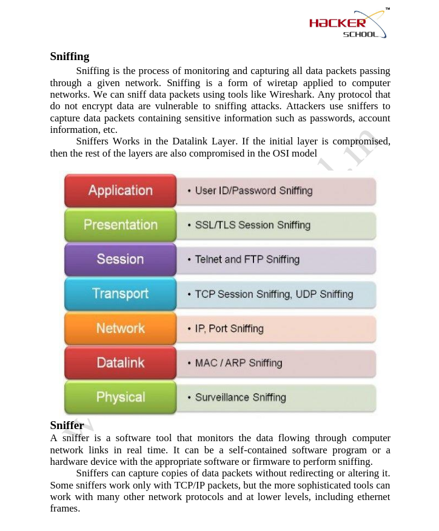
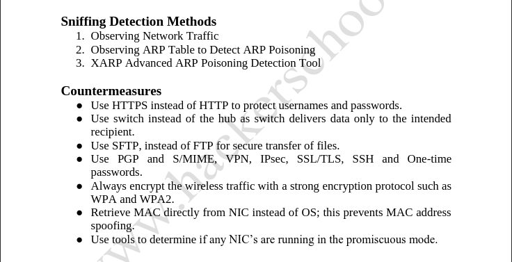
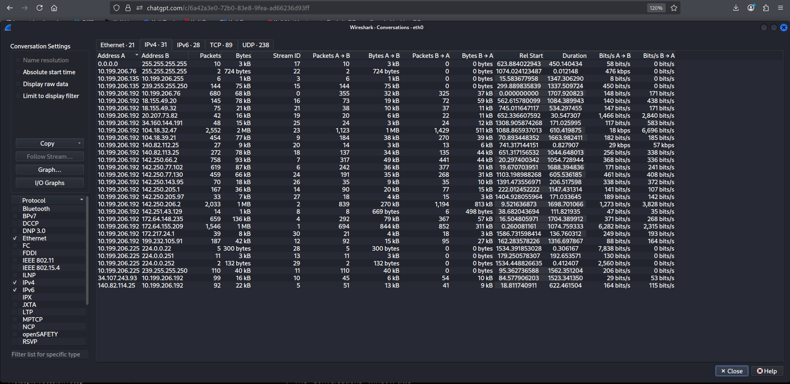
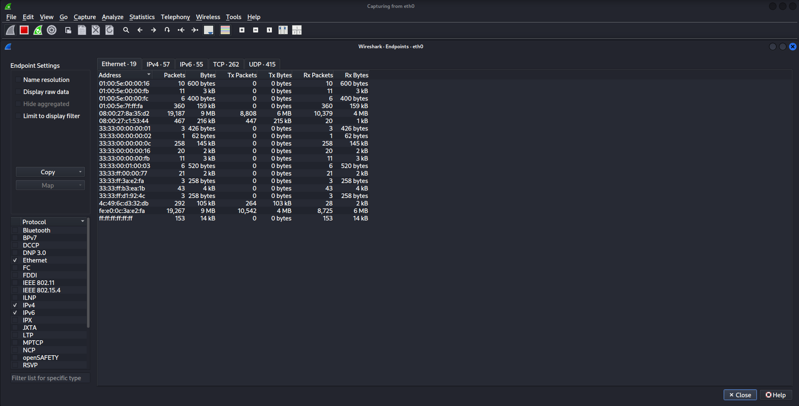
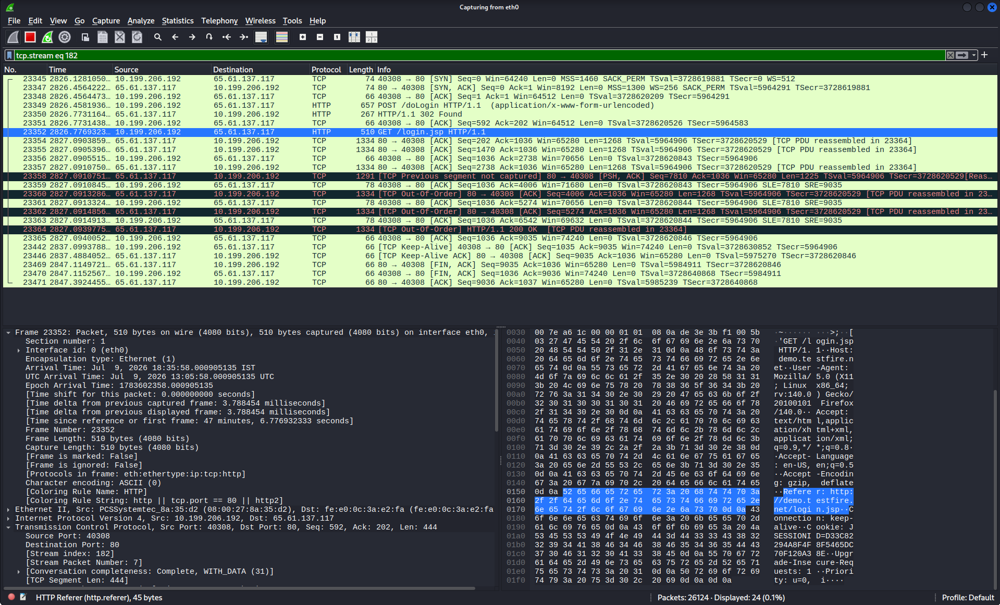
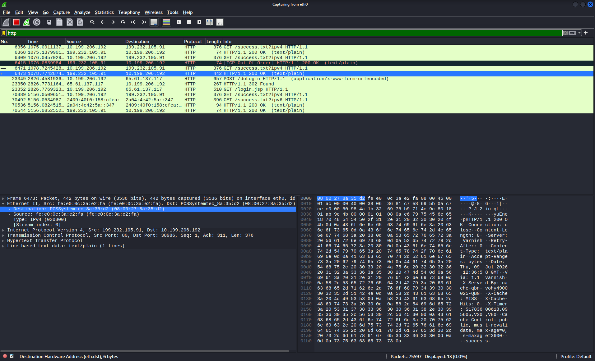

# network-sniffing-and-traffic-analysis

# Part 1 – Introduction to Network Sniffing

## Objective

I want to understand the basics of network sniffing. This includes how sniffers work and the different types of sniffing. I also want to learn about the protocols that're vulnerable to sniffing attacks and how to detect and prevent these attacks.

---

# What is Network Sniffing?

Network sniffing is when you monitor and capture the data packets that travel across a network.

Security professionals use tools to capture these packets and analyze the network traffic.

They do this for troubleshooting. To check the networks performance and security.

Attackers can also use sniffing to capture sensitive information that is sent over the network without proper security.

---

## 1. Understanding Network Sniffing

### What We Are Learning

I am learning about the purpose of network sniffing and how it is used in cybersecurity.

Network sniffing is used to capture packets that travel across a network.

### Description

A network sniffer is a tool that captures these packets without changing them.

It can be used for things like troubleshooting the network and responding to incidents.

It can also be used for bad things like intercepting sensitive information if the communications are not properly protected.

---

## 2. Understanding Sniffers

### What We Are Learning

I am learning what a network sniffer is and how it works.

### Description

A sniffer is a software or hardware tool that captures network packets in time.

Security analysts use sniffers to investigate what is happening on the network.

They use it to identify patterns of communication and to analyze the protocols that are used.

Some examples of sniffers are Wireshark, tcpdump and Bettercap.

---

## 3. Types of Sniffing

### Active Sniffing

sniffing is when you interact with a switched network by sending packets to intercept communications.

For example you might send ARP traffic to a network to get information about the devices that are connected to it.

### Passive Sniffing

Passive sniffing is when you just listen to the network traffic without sending any packets.

This is typically done on shared-media networks.

---

## 4. Protocols Vulnerable to Sniffing

There are some protocols that're more vulnerable to sniffing than others.

These include HTTP, FTP, Telnet, POP3, SMTP, IMAP and SNMP.

These protocols do not encrypt the information they transmit.

So if someone captures the packets they can read the information easily.

---

## 5. Detection and Countermeasures

### Detection Methods

To detect sniffing you can observe the network traffic. Look for anything unusual.

You can also check the ARP tables for any changes.

There are tools that can help you detect ARP spoofing and other types of sniffing.

### Countermeasures

To prevent sniffing you can use HTTPS of HTTP.

You can use SSH of Telnet and SFTP instead of FTP.

You should encrypt the network communications to prevent interception.

You should also use wireless encryption like WPA2 or WPA3.

You should monitor the systems for any suspicious network activity.

---

## Screenshot 1



---

## Screenshot 2



---
**Note** : the screenshots has been taken from the "Hackers School"

**Reason** : i have completed my "CEH certification in Hackers School" 

-------------------------------

# Key Concepts Learned

- Network Sniffing

- Packet Capture

- Active Sniffing

- Passive Sniffing

- Network Protocols

- Detection Methods

- Security Countermeasures

---

# conclusion

In this part I learned what network sniffing is.

I learned how sniffers capture network traffic.

I learned about the difference between passive sniffing.

I learned which protocols are vulnerable to sniffing attacks.

I learned common techniques used to detect and prevent network sniffing attacks.

I learned a lot about network sniffing and how to protect against it.

Network sniffing is a topic, in cybersecurity.

I will keep learning about network sniffing and how to prevent it.

----------------------------------------------------------------------------------------------------------------------------------------------------------------------

# Part 2 – Looking at Network Traffic Using Wireshark Display Filters

## Objective

I want to learn how to use Wireshark display filters to look at network traffic find out which computers are talking to each other and understand what protocols are being used when I am analyzing packets.

---

# What are Wireshark Display Filters?

Wireshark display filters help me look at the packets that I want to see without changing the traffic that I have captured.

They help me get rid of information which makes it faster and easier to analyze packets when I am trying to fix a problem or investigating a security issue.

---

## 1. Look at Traffic by IP Address

### What I Am Doing

I want to see all the packets that are associated with an IP address.

### Filter

```text

ip.addr == 192.168.31.253

```

### Description

This filter shows me all the packets where the IP address I specified's either the source or the destination.

### Screenshot


---

## 2. Look at Traffic by Source IP Address

### What I Am Doing

I want to see packets that are sent from a computer.

### Filter

```text

ip.src == 192.168.31.253

```

### Description

This filter shows me the packets that come from the source IP address I specified.

### Screenshot


---

## 3. Look at Traffic by Destination IP Address

### What I Am Doing

I want to see packets that are sent to a computer.

### Filter

```text

ip.dst == 192.168.31.253

```

### Description

This filter shows me the packets that are going to the destination IP address I specified.

### Screenshot


---

## 4. Look at Traffic by TCP Port

### What I Am Doing

I want to see packets that are using a TCP port.

### Filter

```text

tcp.port == 80

```

### Description

This filter shows me all the packets that are using the TCP port I specified which helps me find traffic that is associated with a network service.

### Screenshot


---

## 5. Show HTTP Requests

### What I Am Doing

I want to see the packets that are HTTP requests.

### Filter

```text

http.request

```

### Description

This filter shows me HTTP request packets, which makes it easier for me to analyze web traffic and understand what the client is asking for.

### Screenshot


---

## 6. Show DNS Queries

### What I Am Doing

I want to see DNS query packets.

### Filter

```text

dns.qry.name

```

### Description

This filter shows me DNS query packets, which helps me find out what domain names the computers on the network are asking for.

### Screenshot


---

# Key Things I Learned

- Wireshark Display Filters

- Source IP Address

- Destination IP Address

- Port Filtering

- HTTP Request Analysis

- DNS Query Analysis

- Packet Filtering

- Network Traffic Analysis

---

# conclusion

In this part I learned how to use Wireshark display filters to look at network traffic that I have captured.

I learned how to find packets using source and destination IP addresses.

I also learned how to filter traffic based on ports.

I found out how to identify HTTP requests and DNS queries.

I understand why display filters are important, for analyzing packets

Wireshark display filters help security analysts look at network activity and find the traffic that's important when they are investigating a security issue.

-------------------------------------


# Part 3 – Advanced Packet Analysis Using Wireshark

## Objective

I want to learn how to look at the network traffic that I have captured. This means I will be analyzing the conversations between hosts looking at the TCP streams and finding out how they are talking to each other.

---

# Why Analyze Packets?

Just capturing packets is not enough. I need to look at how the hostsre talking to each other to understand how people, applications and services are sharing data. Wireshark has a lot of features that help me find things that are happening and fix network problems.

---

## 1. View Network Conversations

### What We Are Doing

I am going to look at the conversations between the hosts that are talking to each other.

### Steps

- I will go to **Statistics → Conversations**.

- Then I will look at the TCP and UDP conversations.

### Description

The Conversations window tells me about the hosts that are talking to each other. It helps me find out which systems are sharing data. I can use Wireshark to look at these Network Conversations and understand what is going on.

### Screenshot



---

## 2. View Network Endpoints

### What We Are Doing

I want to find out which hosts are in the packet capture.

### Steps

- I will go to **Statistics → Endpoints**.

- Then I will look at the list of IP and MAC addresses.

### Description

The Endpoints window shows me all the devices that I can see in the packet capture. It also shows me some statistics about the traffic. I can use Wireshark to look at these Network Endpoints.

### Screenshot



---

## 3. Follow TCP Stream

### What We Are Doing

I am going to look at the conversation between a client and a server.

### Steps

- I will choose any TCP packet.

- Then I will right-click the packet.

- I will choose **Follow → TCP Stream**.

### Description

When I follow a stream I can see the whole conversation between two hosts. This makes it easier for me to look at the requests and responses. I can use Wireshark to follow these Streams.

### Screenshot



---

## 4. Analyze Packet Details

### What We Are Doing

I want to look at the protocol headers and packet information.

### Description

I can look at the protocol layers in the Packet Details pane to see the Ethernet, IP TCP/UDP and application-layer information. I can use Wireshark to analyze these Packet Details.

### Screenshot



---

# Key Concepts Learned

- Network Conversations

- Network Endpoints

- TCP Stream Analysis

- Packet Details

- Protocol Headers

- Network Investigation

---

# conclusion

In this part I learned how to identify the hosts that are talking to each other. 
I learned how to analyze the conversations, between systems. 
I learned how to follow a stream. I learned how to look at the protocol headers.. 
I learned how Wireshark helps people who are investigating network problems and responding to incidents. 
I used Wireshark to learn about Network Conversations, Network Endpoints and TCP Streams.


---------------------------------------------------------------------------------------------------------------------------------------------------------------------------------------------------

# Part 4 – ARP Spoofing Using arpspoof

## Objective

Perform an ARP Spoofing attack in a controlled lab. Verify that the attack works. Understand how security analysts find this attack.

## What is ARP Spoofing?

ARP helps find a devices MAC address using its IP address. ARP Spoofing is when someone sends ARP messages. This makes the victim and gateway think the attackers MAC address is the persons IP address.

So all communication goes through the attackers device.

## Lab Environment

* Attacker: Kali Linux

* Victim: Windows 7

* Network Mode: Bridged Adapter

* Tool Used: arpspoof

## 1. Understanding ARP Spoofing

### What We Are Doing

We are learning how an attacker gets between the victim and gateway.

## Description

Normally the victim talks directly to the gateway.

After ARP Spoofing:

Victim → Kali Linux → Gateway

All packets go through the attackers device.

### Screenshot


## 2. Identifying Network Information

### What We Are Doing

We are finding the IP addresses we need.

## Description

Before the attack find the IP addresses of the attacker, victim and gateway.

### Kali Linux IP Address


### Windows 7 Network Configuration


## 3. Launching the ARP Spoofing Attack

### What We Are Doing

We are starting ARP Spoofing between the victim and gateway.

## Description

Two `arpspoof` commands are used.

The first one tricks the victim.

The second one tricks the gateway.

Together they make a Man-in-the-Middle attack.

### Spoofing the Victim


### Spoofing the Gateway


## 4. Verifying the Attack

### What We Are Doing

We are checking if ARP Spoofing works.

## Verification Using Wireshark

Use this filter:

```

arp

```

Fake ARP replies mean ARP Spoofing is happening.

### Screenshot


## Verification Using Windows ARP Cache

Run:

```

arp -a

```

If the gateway IP maps to the attackers MAC address ARP Spoofing worked.

### Screenshot


## SOC Analyst Perspective

A SOC analyst finds ARP Spoofing by:

* Many ARP replies

* Same MAC addresses

* Gateway MAC address changes

* Arp traffic in Wireshark

* Alerts from IDS/IPS or network tools

Understanding this helps analysts investigate Man-in-the-Middle attacks.

## Key Concepts Learned

* Address Resolution Protocol (ARP)

* ARP Cache

* ARP Spoofing

* ARP Poisoning

* Man-in-the-Middle (MITM)

* Gateway

* MAC Address

* Packet Forwarding

* Wireshark

* arpspoof

# conclusion

In this part I learned:

* How ARP works

* How attackers do ARP Spoofing with arpspoof

* How a Man-in-the-Middle attack happens

* How to verify the attack, with Wireshark and Windows ARP cache

* Why ARP Spoofing is a security threat

* How SOC analysts. Investigate ARP Poisoning attacks.


-----------------------------------------------------------------------------------------------------------------------------------------------------------

# Part 5 – Bettercap for Man-in-the-Middle Attack

## Objective

I want to learn how to use Bettercap to perform a Man-in-the-Middle attack. This involves discovering network hosts selecting a target enabling ARP spoofing and verifying network traffic using Wireshark. I will use Bettercap to perform these tasks.

---

# What is Bettercap?

Bettercap is a tool used by people who test network security. It helps them perform Man-in-the-Middle attacks, discover networks, intercept packets and analyze networks. Bettercap is like a combination of tools including **arpspoof** but it does more things. This makes it very useful for people who test network security and do research.

---

# Lab Environment

Here is my lab setup:

- My attacker machine is Kali Linux

- My victim machine is Windows 7

- My network mode is Bridged Adapter

- I am using these tools:

Bettercap

Wireshark

---

# 1. Starting Bettercap

## What We Are Doing

I am starting the Bettercap framework. This is where I can interact with Bettercap and give it commands.

## Description

To start Bettercap I need to use root privileges. This gives me a console where I can discover networks, spoof ARP intercept traffic and do other network security tasks.

### Command

```bash

sudo bettercap

```

### Screenshot


---

# 2. Discovering Network Hosts

## What We Are Doing

I am finding devices connected to my network. This is a step before I can select a target for ARP spoofing.

## Description

The **net.show** command shows me all the hosts it has discovered. This includes my attacker machine, the gateway and the victim machine. I need this information to select a target.

### Command

```bash

net.show

```

### Screenshot


---

# 3. Configuring the Target

## What We Are Doing

I am selecting the victim machine for ARP spoofing. This is the machine I want to target with my Man-in-the-Middle attack.

## Description

I need to configure the victim IP address as the target for ARP spoofing. Bettercap will try to redirect the victims network traffic through my attacker machine.

### Command

```bash

set arp.spoof.targets 10.199.206.135

```

I should replace the IP address with the IP address of my victim machine if it is different.

### Screenshot


---

# 4. Enabling ARP Spoofing

## What We Are Doing

I am starting the Man-in-the-Middle attack. This is where I use ARP spoofing to position myself between the victim and the gateway.

## Description

The **arp.spoof on** command enables ARP spoofing. Bettercap starts sending ARP replies to get between the victim and the gateway.

### Command

```bash

arp.spoof on

```

### Screenshot


---

# 5. Verifying Network Traffic

## What We Are Doing

I am monitoring ARP traffic while Bettercap is running. This helps me verify that the Man-in-the-Middle attack is working.

## Description

I use Wireshark to monitor ARP packets. If I see ARP traffic it means there is active communication on the network and my attack is working.

### Wireshark Display Filter

```text

arp

```

### Screenshot


---

# SOC Analyst Perspective

As a security analyst I need to understand how attackers use tools like Bettercap. Attackers use these techniques to perform Man-in-the-Middle attacks. I can detect these attacks by looking for signs like ARP reply packets, unexpected MAC address changes and increased ARP traffic.

I can use tools like Wireshark, SIEM platforms and IDS/IPS solutions to detect and investigate these attacks. It is my job to monitor network traffic and look for behavior.

---

# Key Concepts Learned

I learned about these concepts:

- Bettercap Framework

- Network Discovery

- Host Enumeration

- ARP Spoofing

- ARP Poisoning


- Man-in-the-Middle attack

- Gateway Identification

- Target Selection

- Packet Analysis

- Wireshark Verification

- Network Monitoring

---

# conclusion

In this part I learned 

- how to use Bettercap to discover network hosts configure an ARP spoofing target initiate a Man-in-the-Middle attack and verify network traffic using Wireshark. 
- I also learned how to detect these attacks from a security analysts perspective by monitoring ARP traffic and investigating suspicious network behavior. 
- Bettercap is a tool for Man-, in-the-Middle attacks and network analysis.


------------------------------------------------------------------------------------------------------------------------------------------------------------------------------------------------------------


# Part 6 – Detecting and Preventing Sniffing Attacks

## Objective

I want to learn how security professionals find out about sniffing attacks and how they protect networks from these attacks and from Man-in-the-Middle attacks.

---

# Why Detection is Important

Knowing how attackers do sniffing attacks is one part of keeping our computers and networks safe.

Security professionals also need to find activity on the network look into anything that does not seem right and put controls in place to stop attackers from getting sensitive information.

---

# 1. Detecting ARP Spoofing

## What We Are Doing

I am learning how to find out if someone is doing an ARP Spoofing attack.

## Description

The people who watch the network traffic called SOC analysts look at ARP traffic to find anything that's not normal like lots of ARP replies duplicate MAC addresses and changes to the gateway MAC address that are not expected.

### Common Indicators

- The network is sending a lot of ARP Reply packets

- There are MAC Addresses

- The Gateway MAC Address has changed unexpectedly

- The network is not working like it should

- The ARP traffic looks suspicious

### Screenshot


---

# 2. Monitoring Network Traffic

## What We Are Doing

I am using tools to watch the network traffic and find anything

## Description

Security analysts look at what is happening on the network like the packets that are being sent the DNS traffic, the HTTP requests and the ARP communication to find any network behavior that is not normal when they are investigating something.

### Tools

- Wireshark

- IDS/IPS

- SIEM Platforms

- Network Monitoring Solutions

### Screenshot


---

# 3. Preventing Sniffing Attacks

## What We Are Doing

I am learning about the security controls that can stop sniffing attacks.

### Prevention Techniques

- Using HTTPS of HTTP

- Using SSH instead of Telnet

- Using SFTP instead of FTP

- Using a VPN

- Using WPA2 or WPA3 to encrypt the wireless network

- Setting static ARP entries when it is a good idea

- Dividing the network into smaller parts

- Using IDS/IPS to watch the network

### Description

These security controls help keep sensitive information safe from being intercepted and reduce the chance of a successful sniffing attack.

### Screenshot


---

# SOC Analyst Perspective

A SOC analyst looks into sniffing attacks by:

- Watching for ARP traffic

- Looking at the packets that have been sent

- Finding unexpected changes to MAC addresses

- Looking into suspicious DNS and HTTP traffic

- Responding to signs of Man-in-the-Middle attacks

Knowing about the attacks and how to detect them helps security teams find and respond to network attacks more effectively.

---

# Key Concepts Learned

- Detecting sniffing attacks

- Detecting ARP Spoofing attacks

- Looking at packets

- Watching the network traffic

- Using IDS

- Using IPS

- Using SIEM

- Using HTTPS

- Using a VPN

- Communicating securely

---

# conclusion

In this part I learned how security professionals detect sniffing attacks look into network activity and put controls in place to protect networks from packet interception and Man-, in-the-Middle attacks. 
I also learned why it is so important to watch the network traffic and use secure communication protocols to protect modern networks.
